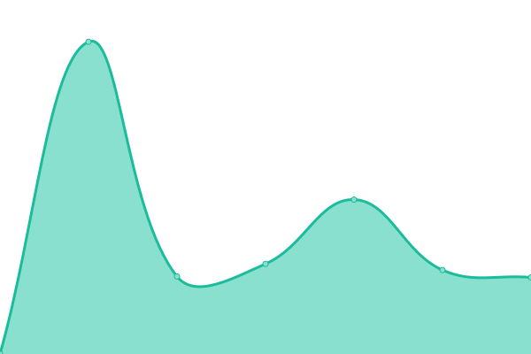
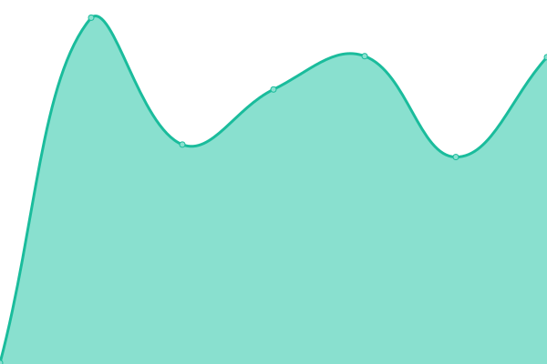
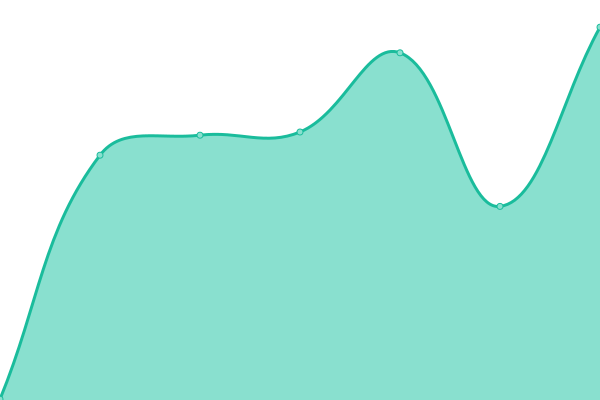

# [📈 Live Status](https://LakesideNetwork.github.io/website-uptime): <!--live status--> **🟩 All systems operational**

This repository contains the open-source uptime monitor and status page for [Lakeside](https://lakeside.net), powered by [Upptime](https://github.com/upptime/upptime).

With [Upptime](https://upptime.js.org), you can get your own unlimited and free uptime monitor and status page, powered entirely by a GitHub repository. We use [Issues](https://github.com/LakesideNetwork/website-uptime/issues) as incident reports, [Actions](https://github.com/LakesideNetwork/website-uptime/actions) as uptime monitors, and [Pages](https://LakesideNetwork.github.io/website-uptime) for the status page.

<!--start: status pages-->
<!-- This summary is generated by Upptime (https://github.com/upptime/upptime) -->
<!-- Do not edit this manually, your changes will be overwritten -->
<!-- prettier-ignore -->
| URL | Status | History | Response Time | Uptime |
| --- | ------ | ------- | ------------- | ------ |
|  [LakesideLink](https://lakesidelink.com) | 🟩 Up | [lakeside-link.yml](https://github.com/LakesideNetwork/website-uptime/commits/HEAD/history/lakeside-link.yml) | 

 1949ms
     
 | 

<a href="https://LakesideNetwork.github.io/website-uptime/history/lakeside-link">99.69%</a>
    

|  [Lakeside Training](https://lakesidetraining.org) | 🟩 Up | [lakeside-training.yml](https://github.com/LakesideNetwork/website-uptime/commits/HEAD/history/lakeside-training.yml) | 

 1102ms
     
 | 

<a href="https://LakesideNetwork.github.io/website-uptime/history/lakeside-training">99.70%</a>
    

|  [Lakeside Garage](https://lakesidegarage.shop) | 🟩 Up | [lakeside-garage.yml](https://github.com/LakesideNetwork/website-uptime/commits/HEAD/history/lakeside-garage.yml) | 

 353ms
     
 | 

<a href="https://LakesideNetwork.github.io/website-uptime/history/lakeside-garage">99.70%</a>
    

|  [Lakeside Greenhouse](https://lakesidegreenhouse.org) | 🟩 Up | [lakeside-greenhouse.yml](https://github.com/LakesideNetwork/website-uptime/commits/HEAD/history/lakeside-greenhouse.yml) | 

 206ms
     
 | 

<a href="https://LakesideNetwork.github.io/website-uptime/history/lakeside-greenhouse">100.00%</a>
    

|  [Lakeside Global](https://lakesideglobal.org) | 🟩 Up | [lakeside-global.yml](https://github.com/LakesideNetwork/website-uptime/commits/HEAD/history/lakeside-global.yml) | 

 410ms
     
 | 

<a href="https://LakesideNetwork.github.io/website-uptime/history/lakeside-global">99.71%</a>
    

|  [Lakeside Technology](https://lakesidetechnology.org) | 🟩 Up | [lakeside-technology.yml](https://github.com/LakesideNetwork/website-uptime/commits/HEAD/history/lakeside-technology.yml) | 

 1231ms
     
 | 

<a href="https://LakesideNetwork.github.io/website-uptime/history/lakeside-technology">99.71%</a>
    

<!--end: status pages-->

[**Visit our status website →**](https://LakesideNetwork.github.io/website-uptime)

## 📄 License

- Powered by: [Upptime](https://github.com/upptime/upptime)
- Code: [MIT](./LICENSE) © [Lakeside](https://lakeside.net)
- Data in the `./history` directory: [Open Database License](https://opendatacommons.org/licenses/odbl/1-0/)
